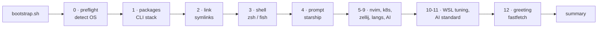

<div align="center">

# dotfiles

**One-command development environment for WSL Arch, WSL Ubuntu and native Windows.**

[](docs/os/arch.md)
[](docs/os/ubuntu.md)
[](docs/os/windows.md)
[](docs/sections/03-shell.md)
[](docs/THEMES.md)
[](LICENSE)

[Install](#install) · [What you get](#what-you-get) · [Themes](docs/THEMES.md) · [Tools](docs/TOOLS.md) · [Cheatsheet](docs/CHEATSHEET.md) · [Docs](docs/README.md)

</div>

---

## Install

**WSL (Arch / Ubuntu)**

```bash
curl -fsSL https://raw.githubusercontent.com/Robertcl795/dotfiles/main/bootstrap.sh | bash
```

**Native Windows** — from pwsh 7, [not Windows PowerShell 5.1](docs/os/windows.md#prerequisite-run-this-from-pwsh-not-windows-powershell-51):

```powershell
winget install Microsoft.PowerShell
pwsh
irm https://raw.githubusercontent.com/Robertcl795/dotfiles/main/bootstrap.ps1 | iex
```

<details>
<summary><b>Other ways to install</b> — from a branch, from a clone, non-interactive</summary>

<br>

```bash
# From a feature branch
BRANCH=my-branch
curl -fsSL "https://raw.githubusercontent.com/Robertcl795/dotfiles/$BRANCH/bootstrap.sh" \
  | DOTFILES_BRANCH=$BRANCH bash

# From a clone
git clone https://github.com/Robertcl795/dotfiles.git ~/.dotfiles
~/.dotfiles/bootstrap.sh

# Non-interactive, everything chosen up front
DOT_NONINTERACTIVE=1 DOT_SHELL=zsh DOT_THEME=cyber ./bootstrap.sh
```

**Fresh Arch WSL** starts as `root` with no user. Run the same command: it
updates the system, enables sudo for `wheel`, creates your user, sets it as
the WSL default, and offers to `wsl --shutdown`. Reopen Arch and the install
**resumes automatically** from a one-shot `~/.bashrc` hook.
Details: [docs/os/arch.md](docs/os/arch.md).

</details>

> [!TIP]
> Keep the repo and your projects under `~/`, never `/mnt/c/...` — cross-OS
> I/O is 10-20× slower. The bootstrap moves off `/mnt` automatically, and the
> shell warns (and auto-`cd`s home) when a session starts there.

## What you get



| Area | What's installed | Docs |
| --- | --- | --- |
| **Shell** | zsh (default) with vi-mode, autosuggestions, fast-syntax-highlighting, history-substring-search — or fish with fisher + fzf.fish | [03-shell](docs/sections/03-shell.md) |
| **Prompt** | [Starship](https://starship.rs), five themes | [THEMES](docs/THEMES.md) |
| **CLI stack** | bat · eza · fzf · zoxide · ripgrep · fd · lazygit · lazydocker · glow · duf · yazi · sshs · lnav · just · zellij | [TOOLS](docs/TOOLS.md) |
| **Greeting** | fastfetch on every new tab | [12-fastfetch](docs/sections/12-fastfetch.md) |
| **Editor** | Neovim + lazy.nvim | [05-nvim](docs/sections/05-nvim.md) |
| **Languages** | rustup · fnm (Node) · uv (Python) · kubectl/helm/k3d | [08-lang-toolchains](docs/sections/08-lang-toolchains.md) |
| **AI** | Claude Code · opencode · gh copilot, plus the [AI Development Standard](ai/README.md) | [09](docs/sections/09-ai-tooling.md) · [11](docs/sections/11-ai-standard.md) |
| **WSL tuning** | `.wslconfig` networking, systemd, NTFS performance guards | [10-wsl](docs/sections/10-wsl.md) |

The aliases you'll use every day — full list in the
[cheatsheet](docs/CHEATSHEET.md):

| Git | | Files | |
| --- | --- | --- | --- |
| `gst` `git status` | `gc` `commit -v` | `ls` eza with icons | `cat` bat |
| `gco` `checkout` | `gcob` `checkout -b` | `z <dir>` zoxide jump | `y` yazi |
| `gsw` `switch` | `gswc` `switch -c` | `lg` lazygit | `ld` lazydocker |
| `gb` `branch` | `gbD` `branch -D` | `ff` fastfetch | `vim` nvim |

## Configure

Everything is interactive by default; every prompt has an env-var override.

| Variable | Values | Default |
| --- | --- | --- |
| `DOT_SHELL` | `zsh` · `fish` | `zsh` |
| `DOT_THEME` | `default` · `tron` · `cyber` · `eva01` · `minimal` | `default` |
| `DOT_ENABLE_K8S` | `0` · `1` | prompt |
| `DOT_NO_FASTFETCH` | `1` disables the shell greeting | unset |
| `DOT_NO_AUTOCD` | `1` keeps shells in `/mnt/*` | unset |
| `DOT_ENABLE_WSLCONFIG` | `0` · `1` — write `.wslconfig` on the Windows host | prompt |
| `DOT_WSL_NETWORKING` | `nat` · `mirrored` | `nat` |
| `DOT_NONINTERACTIVE` | `1` accepts every default | unset |
| `DOT_VERBOSE` | `1` traces every command | unset |
| `DOTFILES_BRANCH` | branch to bootstrap from | `main` |

`bootstrap.ps1` takes the same options as parameters:
`-NonInteractive -Theme <name> -EnableK8s 0|1 -Branch <branch>`.

After changing WSL networking, run `wsl --shutdown` from PowerShell and
reopen your terminal.

## Day to day

```bash
make install                 # re-run the full bootstrap
make test                    # run every checkpoint
make theme THEME=tron        # switch prompt theme, no re-bootstrap
make fastfetch               # reinstall/relink the greeting
make ai-scaffold TARGET=~/p  # drop the AI standard into a repo
```

## Repo layout

| Path | Contents |
| --- | --- |
| `bootstrap.sh` · `bootstrap.ps1` | Entry points (WSL · native Windows) |
| `install/` | Bootstrap phases, one script per phase |
| `windows/` | Native-Windows equivalents |
| `config/` | Configs that get symlinked — [`zsh/`](config/zsh), [`fastfetch/`](config/fastfetch), `starship/`, `git/`, `zellij/`, `alacritty/` |
| `shells/` | Shell entry points (`zshrc`, fish `config.fish` + `conf.d/`) |
| `themes/` | Starship + Windows Terminal themes |
| `nvim/` | Neovim configuration |
| `ai/` | AI Development Standard (agents, prompts, skills, context DB) |
| `tests/` | One checkpoint script per phase |
| `docs/` | [Documentation](docs/README.md) |

## License

MIT — see [LICENSE](LICENSE).
