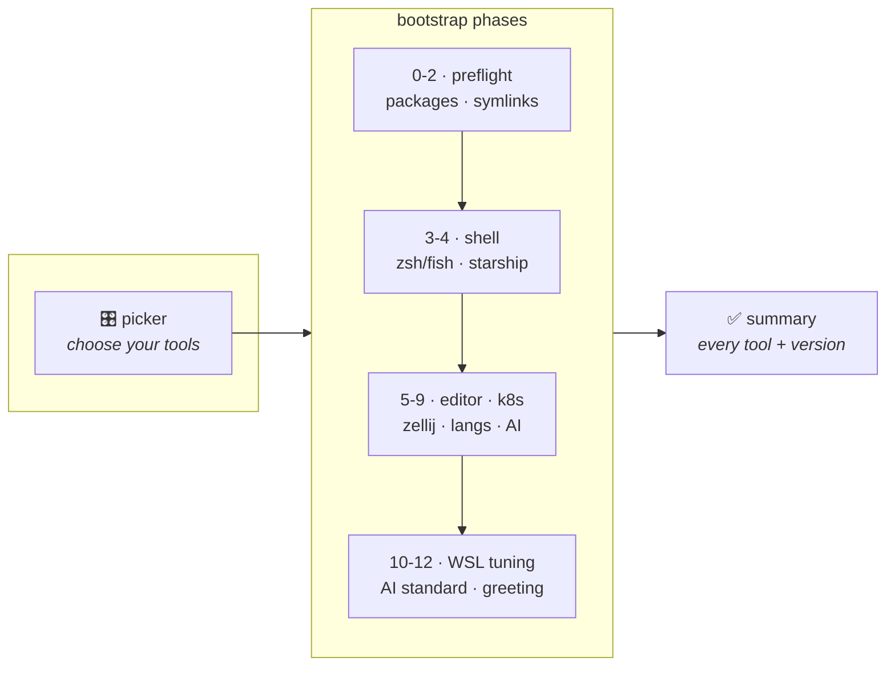
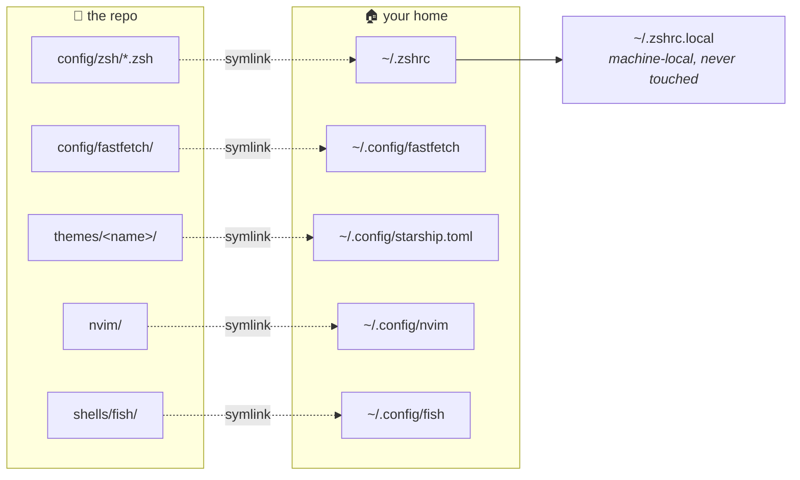

<div align="center">

<br>

# Rocker Labs Dotfiles

**Pick your tools. Run one command. Get the same terminal on every machine.**

WSL Arch · WSL Ubuntu · native Windows

<br>

[](docs/os/arch.md)
[](docs/os/ubuntu.md)
[](docs/os/windows.md)


<br>

**[Install](#-install)** ·
**[Pick your tools](#-pick-your-tools)** ·
**[What you get](#-what-you-get)** ·
**[Themes](docs/THEMES.md)** ·
**[Cheatsheet](docs/CHEATSHEET.md)** ·
**[Docs](docs/README.md)**

<br>

</div>

---

<br>

## 🚀 Install

**WSL — Arch or Ubuntu**

```bash
curl -fsSL https://raw.githubusercontent.com/Robertcl795/dotfiles/main/bootstrap.sh | bash
```

**Native Windows** — from pwsh 7, [not Windows PowerShell 5.1](docs/os/windows.md#prerequisite-run-this-from-pwsh-not-windows-powershell-51)

```powershell
winget install Microsoft.PowerShell
pwsh
irm https://raw.githubusercontent.com/Robertcl795/dotfiles/main/bootstrap.ps1 | iex
```

<details>
<summary><b>Other ways to install</b> — from a branch, from a clone, fully scripted</summary>

<br>

```bash
# From a feature branch
BRANCH=my-branch
curl -fsSL "https://raw.githubusercontent.com/Robertcl795/dotfiles/$BRANCH/bootstrap.sh" \
  | DOTFILES_BRANCH=$BRANCH bash

# From a clone
git clone https://github.com/Robertcl795/dotfiles.git ~/.dotfiles
~/.dotfiles/bootstrap.sh

# Fully scripted — no picker, no prompts
DOT_NONINTERACTIVE=1 DOT_SHELL=zsh DOT_THEME=cyber \
  DOT_TOOLS="bat,eza,fzf,zoxide,starship,neovim" ./bootstrap.sh
```

**Fresh Arch WSL** starts as `root` with no user. Run the same command: it
updates the system, enables sudo for `wheel`, creates your user, sets it as
the WSL default, and offers to `wsl --shutdown`. Reopen Arch and the install
**resumes automatically** from a one-shot `~/.bashrc` hook.
Details: [docs/os/arch.md](docs/os/arch.md).

</details>

> [!TIP]
> Keep the repo and your projects under `~/`, never `/mnt/c/...` — cross-OS
> I/O is 10-20× slower. The bootstrap moves off `/mnt` automatically, and the
> shell warns (and auto-`cd`s home) when a session starts there.

<br>

---

<br>

## 🎛 Pick your tools

Nothing installs until you say so. The first screen is a picker — arrows to
move, space to toggle, enter to go:

```
  ROCKER LABS DOTFILES
  ──────────────────────────────────────────────────────────
  ↑↓ move   space toggle   ←→ change value   a/n section all/none
  A/N everything   r reset to defaults   enter install   q quit

     CLI stack  Modern replacements for the classic Unix tools
 ❯ [✓] bat                    cat with syntax highlighting and paging
   [✓] eza                    ls with icons, git status and tree mode
   [ ] ripgrep                grep that respects .gitignore, much faster
   [✓] fd                     find with sane defaults

     Prompt  Shell prompt and colour theme
   ‹ zsh     › Login shell  which shell the bootstrap makes default
   ‹ cyber   › Theme        prompt colours — see docs/THEMES.md
   [✓] starship               cross-shell prompt, themed
  ──────────────────────────────────────────────────────────
  27 of 30 tools selected
```

Six categories — **CLI stack**, **Prompt**, **Editor**, **Languages**,
**Kubernetes**, **AI tools** — and the same list on every OS: the picker
chooses *tools*, the installer maps each one to pacman, apt or scoop.

It's plain bash and ANSI escapes, because it runs before any package manager
has been touched and can't depend on `fzf` or `gum` existing yet.

```bash
DOT_TOOLS="bat,eza,fzf,starship"   # skip the picker entirely
DOT_TOOLS=all                      # everything
DOT_NONINTERACTIVE=1               # the defaults
```

Your choice is saved to `~/.config/rocker-dotfiles/selection.conf`, so
re-running one phase respects it too. Full guide:
**[docs/SELECTION.md](docs/SELECTION.md)**.

<br>

---

<br>

## 📦 What you get



<br>

| | Area | What's installed | Docs |
| --- | --- | --- | --- |
| 🐚 | **Shell** | zsh with vi-mode, autosuggestions, fast-syntax-highlighting, history-substring-search — or fish with fisher + fzf.fish | [03-shell](docs/sections/03-shell.md) |
| 🎨 | **Prompt** | [Starship](https://starship.rs), five themes | [THEMES](docs/THEMES.md) |
| ⚡ | **CLI stack** | bat · eza · fzf · zoxide · ripgrep · fd · lazygit · lazydocker · glow · duf · yazi · sshs · lnav · just · zellij | [TOOLS](docs/TOOLS.md) |
| 👋 | **Greeting** | fastfetch on every new tab | [12-fastfetch](docs/sections/12-fastfetch.md) |
| ✏️ | **Editor** | Neovim + lazy.nvim | [05-nvim](docs/sections/05-nvim.md) |
| 🔧 | **Languages** | rustup · fnm (Node) · uv (Python) · kubectl/helm/k3d | [08-lang](docs/sections/08-lang-toolchains.md) |
| 🤖 | **AI** | Claude Code · opencode · gh copilot, plus the [AI Development Standard](ai/README.md) | [09](docs/sections/09-ai-tooling.md) · [11](docs/sections/11-ai-standard.md) |
| 🪟 | **WSL tuning** | `.wslconfig` networking, systemd, NTFS performance guards | [10-wsl](docs/sections/10-wsl.md) |

<br>

### The aliases you'll actually use

<table>
<tr><th align="left">Git</th><th align="left">Files</th><th align="left">TUIs</th></tr>
<tr valign="top"><td>

| | |
| --- | --- |
| `gst` | `git status` |
| `gc` | `commit -v` |
| `gco` | `checkout` |
| `gcob` | `checkout -b` |
| `gsw` | `switch` |
| `gswc` | `switch -c` |
| `gb` | `branch` |
| `gbD` | `branch -D` |

</td><td>

| | |
| --- | --- |
| `ls` | eza + icons |
| `ll` | + git status |
| `cat` | bat |
| `grep` | ripgrep |
| `z` | zoxide jump |
| `y` | yazi |
| `vim` | nvim |
| `df` | duf |

</td><td>

| | |
| --- | --- |
| `lg` | lazygit |
| `ld` | lazydocker |
| `ff` | fastfetch |
| `zellij` | multiplexer |
| `sshs` | ssh picker |
| `lnav` | log viewer |
| `glow` | markdown |
| `just` | task runner |

</td></tr>
</table>

Every git alias completes like the command it wraps — `gco <Tab>` offers
branches. Full list: **[docs/CHEATSHEET.md](docs/CHEATSHEET.md)**.

<br>

---

<br>

## 🎨 Themes

Five prompts, switchable without re-running anything. Previews and palettes:
**[docs/THEMES.md](docs/THEMES.md)**.

| Theme | | Palette | Nerd Font |
| --- | --- | --- | --- |
| `default` | two-line, full module set |     | required |
| `tron` | electric cyan on near-black |     | no |
| `cyber` | terminal green, pure ASCII |     | no |
| `eva01` | violet, acid green, hot pink |     | no |
| `minimal` | single line, quietest |     | required |

```bash
make theme THEME=tron     # takes effect in the next shell
```

<br>

---

<br>

## ⚙️ Configure

Every prompt has an environment-variable override.

| Variable | Values | Default |
| --- | --- | --- |
| `DOT_TOOLS` | `all` · `none` · comma-separated ids | the picker |
| `DOT_SHELL` | `zsh` · `fish` | `zsh` |
| `DOT_THEME` | `default` · `tron` · `cyber` · `eva01` · `minimal` | `default` |
| `DOT_ENABLE_K8S` | `0` · `1` — forces the k8s tools in or out | from the picker |
| `DOT_NO_FASTFETCH` | `1` disables the shell greeting | unset |
| `DOT_NO_AUTOCD` | `1` keeps shells in `/mnt/*` | unset |
| `DOT_ENABLE_WSLCONFIG` | `0` · `1` — write `.wslconfig` on the Windows host | prompt |
| `DOT_WSL_NETWORKING` | `nat` · `mirrored` | `nat` |
| `DOT_NONINTERACTIVE` | `1` accepts every default | unset |
| `DOT_VERBOSE` | `1` traces every command | unset |
| `DOTFILES_BRANCH` | branch to bootstrap from | `main` |

`bootstrap.ps1` takes the same options as parameters:
`-NonInteractive -Theme <name> -EnableK8s 0|1 -Branch <branch>`.

<br>

---

<br>

## 🔁 Day to day

```bash
make install                 # re-run the bootstrap (idempotent)
make test                    # run every checkpoint
make theme THEME=tron        # switch prompt theme
make fastfetch               # reinstall/relink the greeting
make ai-scaffold TARGET=~/p  # drop the AI standard into a repo

bash install/select.sh --run # re-open the tool picker
```

<br>

## 🗂 How it fits together



Everything is a symlink back into the repo, so `git pull` updates your live
config. Anything already at a destination is moved to
`<path>.backup.<timestamp>` first — nothing is overwritten silently.

<details>
<summary><b>Repo layout</b></summary>

<br>

| Path | Contents |
| --- | --- |
| `bootstrap.sh` · `bootstrap.ps1` | Entry points (WSL · native Windows) |
| `install/tools.sh` | **Tool registry** — what can be installed, per OS |
| `install/select.sh` | **The picker** |
| `install/` | Bootstrap phases, one script per phase |
| `windows/` | Native-Windows equivalents, including `tools.ps1` |
| `config/` | Configs that get symlinked — [`zsh/`](config/zsh), [`fastfetch/`](config/fastfetch), `starship/`, `git/`, `zellij/`, `alacritty/` |
| `shells/` | Shell entry points (`zshrc`, fish `config.fish` + `conf.d/`) |
| `themes/` | Starship + Windows Terminal themes |
| `nvim/` | Neovim configuration |
| `ai/` | AI Development Standard (agents, prompts, skills, context DB) |
| `tests/` | One checkpoint script per phase |
| `docs/` | [Documentation](docs/README.md) |

</details>

<br>

---

<br>

<div align="center">

**[Documentation](docs/README.md)** · **[Tools](docs/TOOLS.md)** ·
**[Themes](docs/THEMES.md)** · **[Cheatsheet](docs/CHEATSHEET.md)** ·
**[Selection](docs/SELECTION.md)**

MIT — see [LICENSE](LICENSE)

</div>
