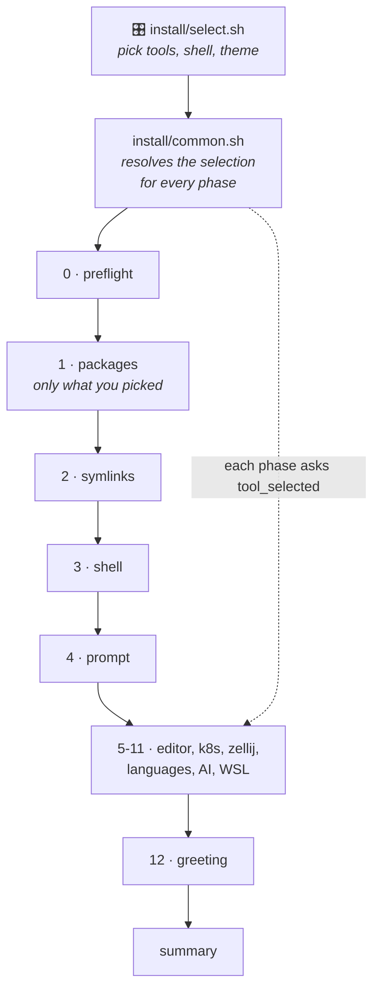

# Rocker Labs Dotfiles — documentation

Start here. The root [README](../README.md) has the install one-liners; this
is the map of everything else.

## Find it fast

| I want to… | Go to |
| --- | --- |
| Choose which tools get installed | [SELECTION.md](SELECTION.md) |
| See every tool, what it replaces, and its alias | [TOOLS.md](TOOLS.md) |
| Pick or preview a prompt theme | [THEMES.md](THEMES.md) |
| Look up a command or keybinding | [CHEATSHEET.md](CHEATSHEET.md) |
| Know which file configures what | [Config map](#config-map) |
| Understand one bootstrap phase | [Phases](#bootstrap-phases) |
| Read OS-specific behaviour | [Arch](os/arch.md) · [Ubuntu](os/ubuntu.md) · [Windows](os/windows.md) |
| Fix something that broke | [Troubleshooting](CHEATSHEET.md#troubleshooting) |

## How a run flows



Each phase asks `tool_selected <id>` before doing anything, so a deselected
tool is skipped with a one-line note rather than installed anyway.

## Config map

Where each piece of behaviour actually lives. Everything under `config/` and
`shells/` is symlinked into place by [phase 2](sections/02-linking.md).

| Config | Repo path | Linked to | Notes |
| --- | --- | --- | --- |
| zsh entry point | `shells/zsh/zshrc` | `~/.zshrc` | Sources the modules below, in order |
| ├ history, options, completion | `config/zsh/core.zsh` | — | `compinit` runs here |
| ├ fzf defaults + `Ctrl+F` picker | `config/zsh/fzf.zsh` | — | |
| ├ general aliases | `config/zsh/aliases.zsh` | — | ls / cat / grep / yazi |
| ├ **git aliases** | `config/zsh/git.zsh` | — | [reference](CHEATSHEET.md#git) |
| ├ keybindings | `config/zsh/bindings.zsh` | — | Registered from `zvm_after_init` |
| ├ plugins | `config/zsh/plugins.zsh` | — | Clones into `~/.local/share/zsh/plugins` |
| ├ prompt | `config/zsh/prompt.zsh` | — | Starship init |
| ├ dev toolchains | `config/zsh/dev.zsh` | — | rustup / fnm / uv / pnpm / AI CLIs |
| ├ WSL helpers | `config/zsh/wsl.zsh` | — | NTFS guard, interop aliases |
| └ greeting | `config/zsh/greeting.zsh` | — | fastfetch, runs last |
| fish entry point | `shells/fish/config.fish` | `~/.config/fish/config.fish` | |
| fish drop-ins | `shells/fish/conf.d/` | `~/.config/fish/conf.d` | `aliases` · `git` · `greeting` · `fzf` |
| Starship prompt | `themes/<theme>/starship.toml` | `~/.config/starship.toml` | or `config/starship/` for `default` |
| fastfetch greeting | `config/fastfetch/` | `~/.config/fastfetch` | `config.jsonc` + `logo/` |
| Neovim | `nvim/` | `~/.config/nvim` | lazy.nvim |
| Zellij | `config/zellij/config.kdl` | `~/.config/zellij/config.kdl` | |
| Git | `config/git/.gitconfig` | `~/.gitconfig` | |
| Alacritty | `config/alacritty/alacritty.toml` | `~/.config/alacritty/alacritty.toml` | |

Machine-local overrides go in `~/.zshrc.local` — sourced last, never touched
by the bootstrap.

## Bootstrap phases

Phases run in this order ([`install/run.sh`](../install/run.sh)). The number
is what `log_step` prints during a run and what each `tests/NN_*.sh`
checkpoint validates.

| # | Script | What it does | Doc |
| --- | --- | --- | --- |
| — | `install/select.sh` | Tool picker (before everything) | [SELECTION](SELECTION.md) |
| 0 | `install/detect_os.sh` | OS detection, network + sudo preflight | [00](sections/00-preflight.md) |
| 1 | `install/packages/{ubuntu,arch}.sh` | System update, CLI stack | [01](sections/01-packages.md) |
| 2 | `install/link.sh` | Symlinks (with timestamped backups) | [02](sections/02-linking.md) |
| 3 | `install/shell/{fish,zsh}.sh` | Shell, plugins, login shell | [03](sections/03-shell.md) |
| 4 | `install/prompt/starship.sh` | Starship + theme selection | [04](sections/04-prompt.md) |
| 5 | `install/nvim.sh` | Neovim + lazy.nvim | [05](sections/05-nvim.md) |
| 6 | `install/dev/k8s.sh` | kubectl, helm, k3d | [06](sections/06-kubernetes.md) |
| 7 | `install/zellij.sh` | Zellij multiplexer | [07](sections/07-zellij.md) |
| 8 | `install/dev/lang.sh` | rustup, fnm, uv | [08](sections/08-lang-toolchains.md) |
| 9 | `install/dev/ai.sh` | Claude Code, opencode, gh | [09](sections/09-ai-tooling.md) |
| 10 | `install/wsl.sh` | `.wslconfig`, systemd, NTFS guards | [10](sections/10-wsl.md) |
| 11 | `install/ai.sh` | AI Development Standard | [11](sections/11-ai-standard.md) |
| 12 | `install/fastfetch.sh` | Shell greeting | [12](sections/12-fastfetch.md) |
| — | `install/summary.sh` | Installed-tools summary (automatic) | [13](sections/13-summary.md) |

Every phase is idempotent and re-runnable on its own:

```bash
bash install/prompt/starship.sh --run     # just this phase
bash tests/04_prompt.sh                   # just this checkpoint
bash tests/99_smoke.sh                    # all checkpoints
```

## Native Windows

No WSL involved — [os/windows.md](os/windows.md) has the full phase
breakdown (`windows/packages.ps1`, `windows/profile.ps1`,
`windows/terminal.ps1`, `windows/summary.ps1`) and the places it
deliberately differs from the WSL path.

## Also see

- [../ai/README.md](../ai/README.md) — the AI Development Standard deployed
  by phase 11.
