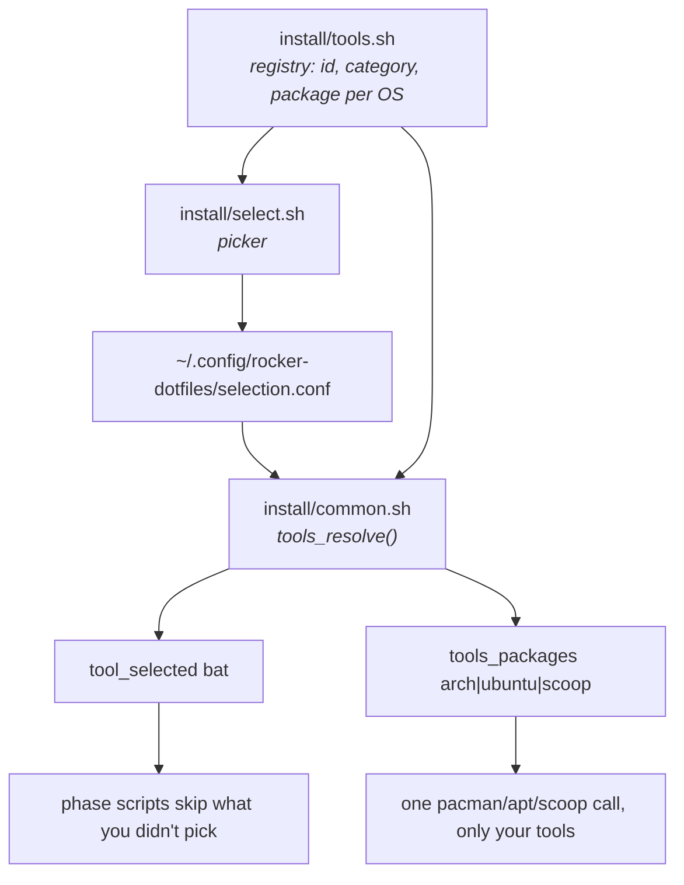

# Choosing what to install

The bootstrap opens a picker before it touches anything. Arrows move, space
toggles, enter installs — and the same list appears whether you're on Arch,
Ubuntu or Windows, because the choice is about *tools*, not packages.

```
  ROCKER LABS DOTFILES
  ──────────────────────────────────────────────────────────
  Choose what to install. Nothing is installed until you confirm.

  ↑↓ move   space toggle   ←→ change value   a/n section all/none
  A/N everything   r reset to defaults   enter install   q quit

     CLI stack  Modern replacements for the classic Unix tools
 ❯ [✓] bat                    cat with syntax highlighting and paging
   [✓] eza                    ls with icons, git status and tree mode
   [ ] ripgrep                grep that respects .gitignore, much faster
   [✓] fd                     find with sane defaults
   …
     Prompt  Shell prompt and colour theme
   ‹ zsh     › Login shell  which shell the bootstrap makes default
   ‹ cyber   › Theme        prompt colours — see docs/THEMES.md
   [✓] starship               cross-shell prompt, themed
  ──────────────────────────────────────────────────────────
  27 of 30 tools selected
```

## Keys

| Key | Does |
| --- | --- |
| `↑` `↓` (or `k` `j`) | Move between rows — section headers are skipped |
| `space` | Toggle the tool under the cursor |
| `←` `→` (or `h` `l`) | Change a value row (shell, theme) |
| `a` / `n` | Select all / none **in the current section** |
| `A` / `N` | Select all / none **everywhere** |
| `r` | Reset to the defaults in `install/tools.sh` |
| `enter` | Confirm and start installing |
| `q` / `Esc` | Quit — nothing is installed |

## Categories

| Category | Contains |
| --- | --- |
| **CLI stack** | bat, eza, ripgrep, fd, fzf, zoxide, duf, tldr, lazygit, lazydocker, yazi, glow, lnav, sshs, just, zellij, fastfetch |
| **Prompt** | starship, plus the login shell and theme value rows |
| **Editor** | Neovim + lazy.nvim |
| **Languages** | rustup, fnm, pnpm, uv |
| **Kubernetes** | kubectl, helm, k3d |
| **AI tools** | Claude Code, opencode, GitHub CLI + Copilot, the AI development standard |

Git, curl, wget, unzip, build tools, zsh and fish are never in the list: the
bootstrap itself needs them, so they're always installed.

## Why it's plain bash

The picker is the *first* thing that runs, before any package manager has
been touched — so it can't depend on `fzf`, `gum`, `dialog` or `whiptail`
being installed. It's ANSI escapes and `read -rsn1`, which is why the same
code works on a bare Arch WSL first boot and on Ubuntu alike.

## Non-interactive

Set `DOT_TOOLS` and the picker never opens:

```bash
DOT_TOOLS="bat,eza,fzf,zoxide,starship,neovim" ./bootstrap.sh
DOT_TOOLS=all ./bootstrap.sh          # everything in the registry
DOT_TOOLS=none ./bootstrap.sh         # base infrastructure only
DOT_NONINTERACTIVE=1 ./bootstrap.sh   # the registry defaults
```

An unknown id is a hard error listing every valid one — a typo that silently
skipped a tool would only be noticed days later.

## How the choice reaches the installers



Resolution order, highest priority first:

1. **`DOT_TOOLS` in the environment** — explicit always wins.
2. **`~/.config/rocker-dotfiles/selection.conf`** — what you picked last time.
3. **The registry defaults** in `install/tools.sh`.

Because the choice is saved, re-running a single phase respects it too:

```bash
bash install/nvim.sh --run     # "Phase 5: Neovim not selected, skipping."
```

## Adding a tool to the registry

One line in [`install/tools.sh`](../install/tools.sh):

```
id|category|label|description|default|arch|ubuntu|scoop
```

The three package columns hold that manager's package name, or `-` when a
custom installer handles it (release binary, upstream install script), or `x`
when the tool doesn't exist on that OS at all. Then gate the install with
`tool_selected <id>`. Mirror it in
[`windows/tools.ps1`](../windows/tools.ps1) to keep the two paths aligned.

`tests/13_selection.sh` checks the registry for duplicate ids, unknown
categories, malformed rows and empty package columns, so a bad entry fails
the checkpoint rather than the install.

## Changing your mind later

```bash
bash install/select.sh --run    # re-open the picker, then:
make install                    # apply the new selection
```

Deselecting a tool does **not** uninstall it — the bootstrap only ever adds.
Remove what you no longer want with your package manager.
