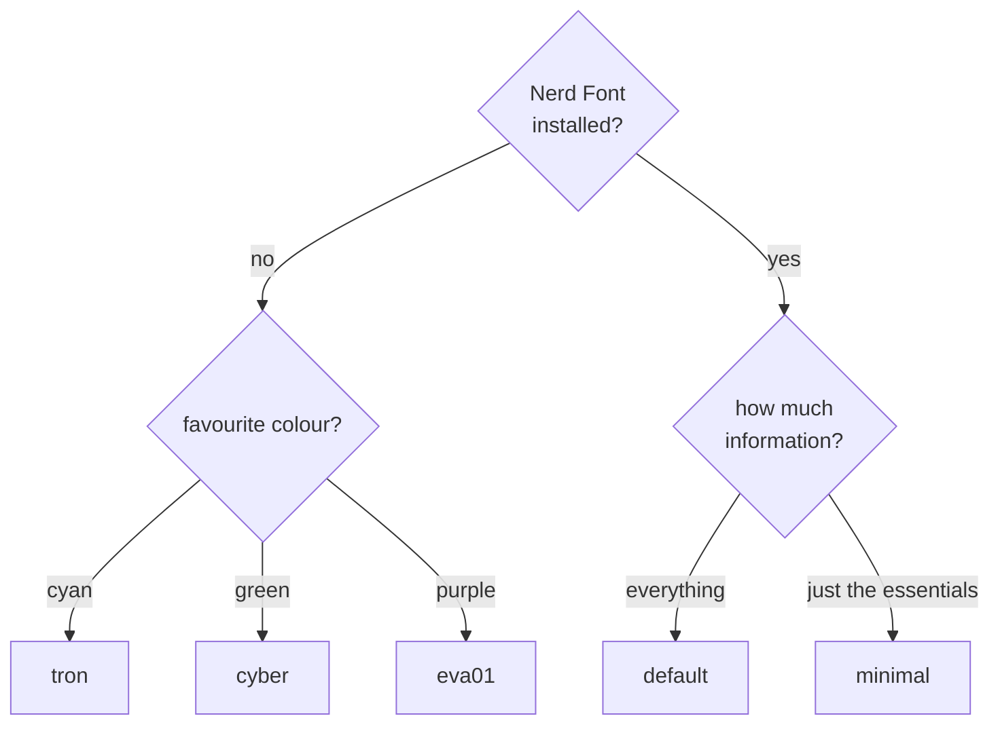

# Themes

Five prompt themes. Each one is a [Starship](https://starship.rs) config,
and four of them ship a matching Windows Terminal colour scheme so the
terminal and the prompt agree.

Set at install time (`DOT_THEME=<name>`) or switched any time afterwards:

```bash
make theme THEME=tron            # or: DOT_THEME=tron bash install/prompt/starship.sh --run
```

The change is a symlink swap on `~/.config/starship.toml` — it takes effect
in the next shell, no re-bootstrap needed.

## Which one?



## Gallery

### `default`


Two-line box-drawing prompt with the full module set — user, host, dir, git,
node, python, rust, docker, kubernetes, and command duration on the right.
The most informative of the five, and the only one using Nerd Font icons for
the language modules.

```
╭─user@host ~/projects/app on  main via  20.11.0
╰─➜
```

File: [`config/starship/starship.toml`](../config/starship/starship.toml) ·
no Windows Terminal scheme (keeps your terminal's current colours).

### `tron`


Near-black background, electric cyan foreground, one accent colour doing all
the work. Two-line prompt with `>>` / `➜`; modules are labelled in text
(`git:`, `node:`, `py:`, `rs:`) rather than icons — no Nerd Font required.

```
>>user@host ~/projects/app on git:main via node:20.11.0
➜
```

Files: [`themes/tron/`](../themes/tron) · scheme `dotfiles-tron`

### `cyber`


Terminal-green on GitHub-dark, and the most conservative of the set: pure
ASCII throughout (`>>`, `$`, `>`, `x`, `git:`, `k8s:`). Renders identically
in any font, on any terminal — the safe pick for a bare console or a machine
you don't control.

```
>>user@host ~/projects/app on git:main via node:20.11.0
$ >
```

Files: [`themes/cyber/`](../themes/cyber) · scheme `dotfiles-cyber`

### `eva01`


Deep violet background, lilac foreground, acid-green and hot-pink accents.
Same ASCII-safe module labels as `cyber`, with `::` / `:]` prompt brackets.

```
::user@host ~/projects/app on git:main via node:20.11.0
:] >
```

Files: [`themes/eva01/`](../themes/eva01) · scheme `dotfiles-eva01`

### `minimal`


Single-line, no leading newline, distro icon + path + git + the language of
the current project. The quietest of the five — everything else is dropped.
**Needs a Nerd Font** for the OS and branch glyphs.

```
~/projects/app 󰣇  main +2 ●1 ❯
```

Files: [`themes/minimal/`](../themes/minimal) · scheme `dotfiles-minimal`

## What's in a theme

| File | Used by | Applied how |
| --- | --- | --- |
| `themes/<name>/starship.toml` | WSL + native Windows | Symlinked to `~/.config/starship.toml` (WSL); `$env:STARSHIP_CONFIG` points at it directly on Windows |
| `themes/<name>/windows-terminal.json` | Windows Terminal only | Merged into `settings.json` as `dotfiles-<name>`, applied to PowerShell profiles only |

`default` has no Windows Terminal scheme — on the native-Windows path,
`DOT_THEME` defaults to `cyber` instead.

## Fonts

| Theme | Needs a Nerd Font? |
| --- | --- |
| `default` | Yes — Nerd Font icons for git and language modules |
| `minimal` | Yes — OS and branch glyphs |
| `tron` | No (`➜`/`✗`/`☸` are plain Unicode) |
| `cyber` | No — pure ASCII |
| `eva01` | No — pure ASCII |

`eza --icons` and the [fastfetch greeting](sections/12-fastfetch.md) want a
Nerd Font regardless of theme. Install any
[Nerd Font](https://www.nerdfonts.com/) and select it in your terminal —
JetBrainsMono, FiraCode and CaskaydiaCove are all good picks.

Boxes instead of icons is always a font problem, never a theme problem.

## Adding a theme

1. `mkdir themes/<name>` and drop in a `starship.toml`.
2. Optionally add `windows-terminal.json` with `"name": "dotfiles-<name>"`.
3. Add it to the pickers in
   [`install/common.sh`](../install/common.sh) (`select_theme`) and
   [`windows/common.ps1`](../windows/common.ps1) (`Select-Theme`).

`install/prompt/starship.sh` falls back to the default config with a warning
if `DOT_THEME` doesn't match a directory, so a typo never breaks a run.
